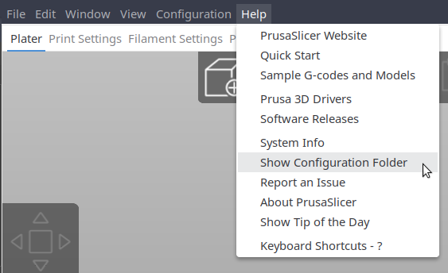

These are my [PrusaSlicer][prusaslicer] profiles and settings for the
[Sovol SV06 Plus][sovol-sv06-plus].

# Usage

This repository is meant to be cloned into PrusaSlicer's configuration folder.
This folder's location varies by operating system:

* Linux: **~/.config/PrusaSlicer**
* Mac: **~/Library/Application Support/PrusaSlicer**
* Windows: **C:/Users/(username)/AppData/Roaming/PrusaSlicer**

You can also check the location of this folder using PrusaSlicer's **Help** -> **Show
Configuration Folder** option:

# Sovol SV06 Plus profile

PrusaSlicer includes a built-in Sovol SV06 Plus printer profile.

My Sovol SV06 Plus printer profile is based on the built-in profile with custom
start and end G-code, plus a different bed mesh and texture.

## G-code customizations

Start G-code:

* Heat the bed to 5°C below the target bed temperature before heating the
  nozzle.
* Draw the purge line just outside the print area along the X-axis (the built-in
  profile draws the purge line within the print area along the Y-axis), like the
  Prusa MK3S+ built-in profile. I randomized the purge line position
  along the X-axis to prevent wear on a single spot.

End G-code:

* Raise the Z-axis higher than the default profile does, along with a small
  filament retraction.
* Stop heating the nozzle and bed before turning off the fan.

# Attribution and License

The [Sovol SV06 Plus bed model](printer/beds/sovol-sv06-plus-model.stl) was exported from
[Sovol's complete assembly model for the SV06 Plus][sovol-sv06-plus-complete-assembly-model].

The [Sovol SV06 Plus bed texture image](printer/beds/sovol-sv06-plus-texture-white-logo.png)
is from
[Catfisher4's SV06 Plus Build Plate Package][catfisher4-sv06-plus-build-plate-package],
licensed under
[Creative Commons (4.0 Interational License) Attribution][cc-by-4.0].

The remaining contents of this repository are licensed under
[Creative Commons CC0 1.0 Universal (Public Domain)][license].

[cc-by-4.0]: http://creativecommons.org/licenses/by/4.0/
[license]: http://creativecommons.org/publicdomain/zero/1.0/
[prusaslicer]: https://www.prusa3d.com/page/prusaslicer_424/
[sovol-sv06-plus]: https://www.sovol3d.com/products/sovol-sv06-plus-fully-open-source-3d-printer-with-linear-rail-structure
[sovol-sv06-plus-complete-assembly-model]: https://github.com/Sovol3d/SV06-PLUS/blob/master/SV06%20PLUS%203D/STEP/SV06%20Plus%20Complete%20Assembly%20300x300x340.rar
[catfisher4-sv06-plus-build-plate-package]: https://www.printables.com/model/534551-sovol-sv06-plus-build-plate-package-texture-and-mo
